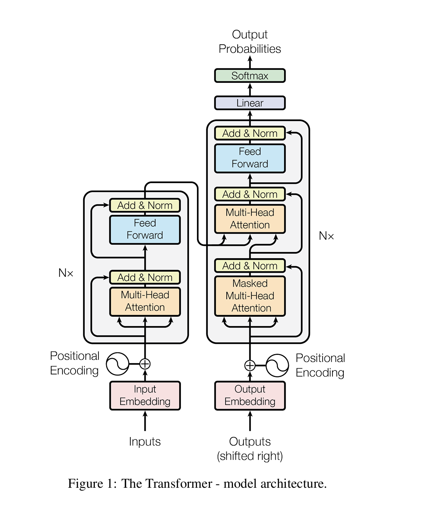

# Attention Is All You Need

## Abstract

  现在主要的主导序列传输模型为卷积(convolutional)或者循环( recurrent )神经网络，包含解码器decoder和编码器encoder通过注意力机制连接。

  	该论文提出了新的简单网络架构-Transformer，舍弃卷积和循环，完全放在注意力(attention)机制上，在文章提到的实验中，这些模型质量更优斌并且易于并行化。

## 1 Introduction

  循环神经网络(RNN)已经被牢固地确立为序列建模和序列转换问题。

  循环模型通常将计算沿输入序列和输出序列的符号位置进行分解。将这些位置与计算时间的步骤对齐时，它们会生成隐藏状态序列 ht，其作为前一隐藏状态 ht−1 和位置 t 的输入的函数。这种固有的序列性特征排除了训练样本内的并行处理，这在序列较长时显得尤为关键，因为内存限制会限制跨样本的批处理。

  注意力机制已经成为各种任务中引人注目的序列建模和转换模型的组成部分，允许在建模依赖关系时不考虑它们在输入或输出序列中的距离。然而，除少数情况外，这种注意力机制通常与循环网络结合使用。

  但本文提出的transformer架构，放弃循环，完全依赖注意力机制来建立输入与输出之间的全局依赖关系。实验结果显示，该架构在仅使用八个P100 GPU训练十二小时后，就可以达到翻译质量的新最先进水平。

## 2 Background

  RNN依赖固有顺序执行，难以并行化，记忆差

  CNN虽然可以并行计算，但关联远距离位置需要的操作数随距离增长

  当时注意力通常与RNN结合使用，很少有模型完全依赖注意力

   transformer 是第一个完全依赖自注意力计算其输入和输出表示的转换模型，而不使用序列对齐的 RNN 或卷积。

## 3 Model Architecture

  Transformer遵循这种总体架构，对编码器和解码器都使用堆叠的自注意力和逐点全连接层，分别如图1的左半部分和右半部分所示。

### 3.1 Encoder and Decoder Stacks

  编码器：编码器由堆叠的 N = 6 个相同的层组成。每一层都有两个子层。第一个是多头自注意力机制，第二个是一个简单的、按位置分布的全连接前馈网络。我们在每个子层周围使用残差连接 ，然后进行层归一化。

  解码器：解码器也由 N = 6 个相同的层堆叠组成。除了每个编码器层中的两个子层外，解码器还插入了第三个子层，该子层对编码器堆的输出执行多头注意力。与编码器类似，我们在每个子层周围使用残差连接，然后进行层归一化。我们还修改了解码器堆中的自注意力子层，以防止位置关注后续位置。该掩码结合输出嵌入偏移一个位置的事实，确保位置 i 的预测只能依赖于小于 i 的已知输出。

### 3.2 Attention

  注意力函数可以被描述为将查询和一组键值对映射到输出，其中查询、键、值和输出都是向量。输出是通过值的加权和计算得出的，每个值的权重是由查询与对应键的兼容性函数计算的

  

#### 	3.2.1 Scaled Dot-Product Attention

​            缩放点积注意力是 Transformer 的"心脏"

$$
Attention(Q,K,V ) = softmax(QK^T/\sqrt{d_k})V
$$
​           **Q（Query，查询）**:"哪些词与我有关？"

​           **K（Key，键）**:"每个词的标签"

​           **V（Value，值）**:"每个词携带的内容"

​           **QKᵀ（Q乘K的转置）**:"把"查询纸条"和每本书的"标签"做对比，算相似度。，相似度越高，说明两个词关系更近"

​           **√dₖ**:"K的维度大小"，除以这个维度是为了"降温"：当维度很高时，点积数值会变得巨大，导致后面的 softmax 太极端。除一下，让                                 

​         分数分布更平缓，训练更稳定

​           **softmax()**:"把相似度分数变成概率（加起来等于1)"

​          V:"按上面算出的概率权重，把所有词的 Value 做加权平均。"

####      3.2.2 Multi-Head Attention

​        **Multi-Head Attention**（多头注意力）的核心思想一句话：**"与其让一个人同时看所有东西，不如让多个人各看各的，最后把他们的发现汇总起来。"**

​       
$$
MultiHead(Q,K,V ) = Concat(head1,...,headh)W^O
$$
WHERE
$$
head_i = Attention(QW^Q_
i ,KW^K_
i ,VW^V_
i )
$$
​             其中
$$
QW^Q_
i ,KW^K_
i ,VW^V_
i
$$
​           为第 *i*  个"注意力头"的专属"眼镜"，把高维的 Q/K/V 投影到一个低维子空间（比如从512维压到64维），每个头的眼镜参数不同，所以看到的东西角度不同

​          在这项工作中，我们使用了 h = 8 个并行的注意力层，或称为头。对于每一个头，我们使用
$$
d_k = d_v =d_{model}/h = 64
$$
由于每个头的维度减少，总的计算成本与全维度单头注意力的成本相似。

####    3.2.3 Applications of Attention in our Mode

​    Transformer 在三个不同的方式中使用多头注意力：

-   在“编码器-解码器注意力”层中，查询来自前一解码器层，而记忆键和值来自编码器的输出。这允许解码器中的每个位置关注输入序列中的所有位置。这模拟了序列到序列模型中典型的编码器-解码器注意力机制。
-   编码器包含自注意力层。在自注意力层中，所有的键、值和查询都来自同一来源，在此情况下，来自编码器前一层的输出。编码器中的每个位置都可以关注编码器前一层的所有位置。
-   同样，解码器中的自注意力层允许解码器中的每个位置关注解码器中直到该位置的所有位置。为了保持自回归属性，我们需要防止解码器中的左向信息流动。我们通过在缩放点积注意力中屏蔽掉所有对应非法连接的 softmax 输入值来实现这一点。

### 3.3 Position-wise Feed-Forward Networks(逐位置前馈网络)

  除了注意力子层之外，我们的编码器和解码器中的每一层都包含一个全连接的前馈网络，该网络分别且相同地应用于每个位置。这包括两个线性变换，中间夹着一个 ReLU 激活。
$$
FFN(x) = max(0,xW1 +b1)W2 +b2
$$

$$
FFN(x)=ReLU(z)⋅W 
2
​
 +b 
2
​
  
$$

  Relu它的作用是在两次线性变换之间插入非线性，让网络有能力学习复杂文本模式，而不是只会做线性加减。

### 3.4 Embeddings and Softmax

  模型用**学习到的嵌入**把输入和输出的 token 都映射成512维向量；解码器输出的向量再经过**学习到的线性变换**和 **softmax** 变成下一个 token 的概率。为了省参数和保持一致性，**输入嵌入、输出嵌入、softmax前的线性层**这三者共享**同一个权重矩阵**。另外，嵌入层的权重还要先乘以√dmodel，避免被位置编码"淹没"

### 3.5 Positional Encoding

  由于我们的模型不包含循环和卷积，为了让模型能够利用序列的顺序，我们必须注入一些关于序列中标记的相对或绝对位置的信息。为此，我们在编码器和解码器堆栈底部的输入嵌入中添加了“位置编码”。位置编码与嵌入具有相同的维度 dmodel，因此两者可以相加。位置编码有许多选择，包括学习的和固定的。在这项工作中，我们使用不同频率的正弦和余弦函数：
$$
PE(pos,2i) = sin(pos/10000^{2i/d_{model}}	)
$$

$$
PE(pos,2i+1) = cos(pos/10000^{2i/d_{model}}	)
$$

  其中 pos 是位置，i 是维度。也就是说，位置编码的每个维度对应一个正弦函数。波长形成从 2π 到 10000·2π 的几何级数。我们选择这个函数是因为我们假设它可以让模型更容易地学习按相对位置进行注意力，因为对于任何固定的偏移 k，PE_{pos+k} 可以表示为 PE_{pos} 的线性函数。我们还尝试使用学习到的位置嵌入，并发现这两种版本产生的结果几乎相同。我们选择正弦版本是因为它可能允许模型外推到比训练时遇到的序列更长的长度

## 4 Why Self-Attention

  作者从**计算复杂度、可并行化程度（顺序操作数）和长程依赖路径长度**三个维度，将自注意力层与循环层（RNN）和卷积层（CNN）进行严格对比：自注意力以 *O*(1)  的常数顺序操作和常数路径长度完胜 RNN 的 *O*(*n*) ，在序列长度小于表示维度时计算效率也更优；相比 CNN，其路径长度 *O*(1)  也优于 CNN 的 *O*(logk>n)  或 *O*(*n*/*k*) ，且复杂度至少不逊于最优的可分离卷积；此外，自注意力还提供了可直接可视化的注意力分布，使模型更具可解释性。

## 5 Training

  Transformer 提出了首个完全基于注意力机制的序列转换架构，通过多头自注意力、带残差连接与层归一化的前馈网络，以及正弦位置编码，彻底摒弃了 RNN 和 CNN；其核心优势在于以 *O*(1)  的常数路径长度和顺序操作实现全局依赖建模，使训练高度并行化且成本极低——在 8 块 P100 GPU 上仅需 12 小时（base）或 3.5 天（big）即可收敛，最终在 WMT 2014 英德和英法翻译任务上以远超此前所有模型（包括集成模型）的 BLEU 分数（28.4 / 41.8）和仅约对手 1/45 的训练开销，奠定了现代大语言模型的基石。
$$
lrate = d^{−0.5}
_{model} · min(step_num^{−0.5},step_num · warmup_steps^{−1.5})
$$

## 6 Result

### 6.1 机器翻译（Machine Translation）

  论文的**"验货环节"**——作者用实验回答三个问题：① 翻译效果有多强？② 每个组件真的有用吗？③ 换到其他任务还能打吗？

  big 模型超过之前所有已报道的模型（包括集成模型）**2.0+ BLEU**，创下 **28.4** 的新纪录。

  Base 模型（27.3 BLEU）就已经超过了之前所有模型和集成模型，而且训练成本只是对手的一个零头。

  论文估算 FLOPs 的方法： 总FLOPs=训练时间×GPU数量×单GPU持续浮点算力 

## 6.2 模型变体（Model Variations）—— 消融实验

这是整篇论文**最硬核的论证**之一。作者在英德翻译开发集（newstest2013）上，把 base 模型的各个组件逐一"拆掉"或"改动"，看性能怎么变。结果在 **Table 3**：

  多头注意力确实有用，但**不是越多越好**。头数太多导致每个头的维度 *d**k*  太小（32维甚至16维），"分辨率"不够，反而学不好。

  减小 key 的维度会损害质量。作者推测：判断两个向量"兼不兼容"（compatibility）并不是一件简单的事，也许需要比点积更复杂的兼容性函数（这也启发了后来各种改进注意力机制的工作）。

  模型越大通常越好，但层数 *N*=8  时反而略降，说明不是无脑堆层

  Dropout **极其重要**。没有 dropout，模型严重过拟合，BLEU 掉 1.2。Big 模型参数量更大（213M），更需要 dropout（所以 big 用 0.3）。

## 6.3 英语成分句法分析（English Constituency Parsing）

1. 尽管**完全没有任务特定的精细调参**，Transformer 表现仍然惊人
2. WSJ only  setting：F1 91.3，仅次于专门设计的 RNN Grammar（91.7），**超过了 BerkeleyParser**
3. Semi-supervised：F1 92.7，**超过所有之前的半监督模型**
4. 特别地，RNN 序列到序列模型在这个任务上表现很差，而 Transformer **轻松超越**

## 7 Conclusion

  注意，我们用多头自注意力替换了编码器-解码器架构中最常用的循环层。在翻译任务中，Transformer 的训练速度明显快于基于循环或卷积层的架构。在 WMT 2014 英语到德语和 WMT 2014 英语到法语的翻译任务中，我们取得了新的最先进水平。在前一个任务中，我们的最佳模型甚至超过了之前报告的所有集成模型。我们对基于注意力的模型的未来感到兴奋，并计划将其应用于其他任务。我们计划将 Transformer 扩展到涉及文本以外输入和输出模式的问题，并研究局部受限注意力机制，以高效处理如图像、音频和视频等大规模输入和输出。使生成过程不那么顺序化也是我们的另一个研究目标。

